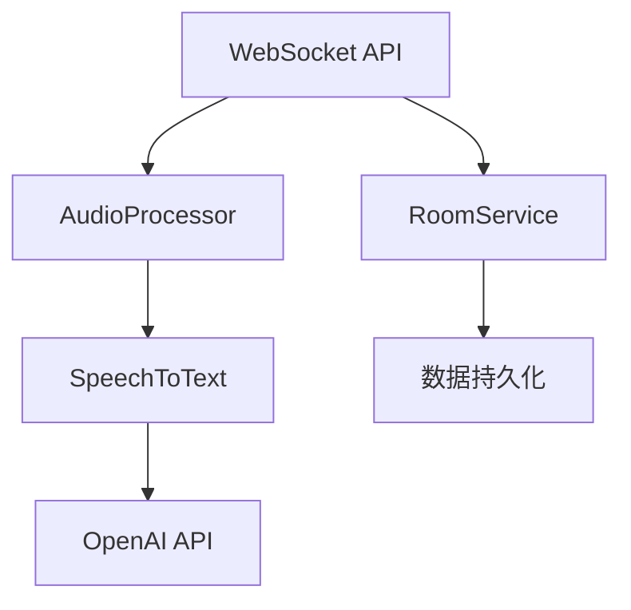

# Services 模块

服务层模块包含所有业务逻辑处理服务。

## 文件结构

```
services/
├── audio_processor.py  # 音频处理服务
├── room_service.py     # 房间管理服务
├── speech_to_text.py   # 语音转文本服务
└── __init__.py        # 模块初始化
```

## 功能说明

### audio_processor.py

音频处理服务，负责：

- 音频数据预处理
- 实时音频流处理
- 音频格式转换
- 音频质量优化

主要功能：

```python
class AudioProcessor:
    async def process_audio(self, audio_data: bytes) -> np.ndarray:
        """处理原始音频数据"""

    async def optimize_audio(self, audio: np.ndarray) -> np.ndarray:
        """优化音频质量"""

    async def segment_audio(self, audio: np.ndarray) -> List[np.ndarray]:
        """音频分段"""
```

### room_service.py

房间管理服务，提供：

- 房间的 CRUD 操作
- 房间状态管理
- 参与者管理
- 房间数据持久化

主要功能：

```python
class RoomService:
    async def create_room(self, room_data: RoomCreate) -> Room:
        """创建新房间"""

    async def get_room(self, room_id: str) -> Room:
        """获取房间信息"""

    async def add_participant(self, room_id: str, user_id: str) -> None:
        """添加参与者"""
```

### speech_to_text.py

语音转文本服务，实现：

- 实时语音识别
- 多语言支持
- 识别结果优化
- 集成 OpenAI Whisper API

主要功能：

```python
class SpeechToText:
    async def transcribe(self, audio: np.ndarray) -> str:
        """音频转文本"""

    async def transcribe_stream(self, audio_stream: AsyncIterator[bytes]) -> AsyncIterator[str]:
        """流式音频转文本"""
```

## 服务依赖关系



## 错误处理

服务层定义了以下异常类：

- `AudioProcessingError` - 音频处理错误
- `RoomServiceError` - 房间管理错误
- `TranscriptionError` - 转录错误

错误处理示例：

```python
try:
    audio_data = await audio_processor.process_audio(raw_audio)
except AudioProcessingError as e:
    logger.error(f"音频处理失败: {str(e)}")
    # 错误处理逻辑
```

## 配置和依赖

服务模块依赖：

- OpenAI API
- PyTorch
- NumPy
- SoundDevice
- SoundFile

配置示例：

```python
# 音频处理配置
SAMPLE_RATE = 16000
CHUNK_SIZE = 1024
CHANNELS = 1

# OpenAI 配置
OPENAI_MODEL = "whisper-1"
```

## 性能优化

服务层实现了以下优化：

1. 异步处理

   - 使用 `asyncio` 实现非阻塞操作
   - 并发处理多个请求

2. 缓存机制

   - 房间信息缓存
   - 音频处理结果缓存

3. 资源管理
   - 连接池
   - 内存使用优化
   - 定时清理机制
