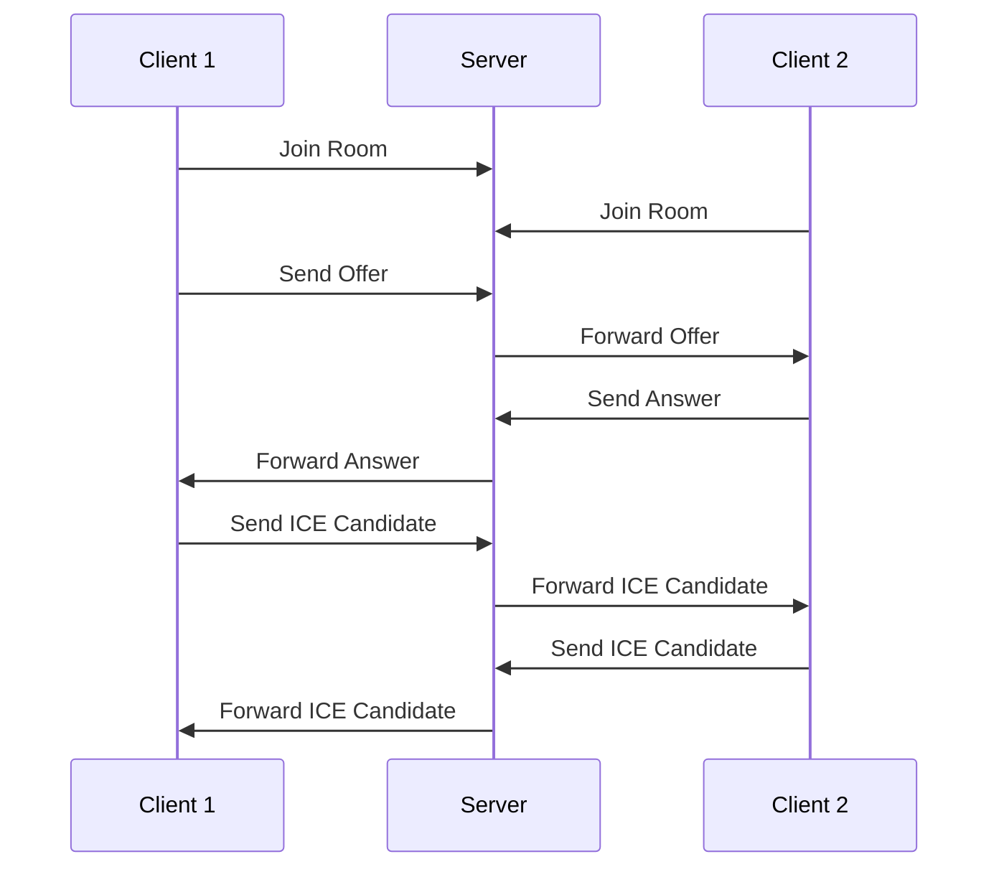

# WebSocket 模块

WebSocket 模块处理实时音频通信和 WebRTC 信令。

## 文件结构

```
websocket/
└── signaling.py  # WebRTC 信令服务
```

## 功能说明

### signaling.py

WebRTC 信令服务，负责：

- 处理 WebRTC 连接建立
- ICE 候选者交换
- SDP 协商
- 连接状态管理

主要功能：

1. 信令消息处理

```python
async def handle_signaling(websocket: WebSocket, room_id: str, client_id: str):
    """处理 WebRTC 信令"""
```

2. 连接协商

```python
async def handle_offer(websocket: WebSocket, data: dict):
    """处理 SDP offer"""

async def handle_answer(websocket: WebSocket, data: dict):
    """处理 SDP answer"""

async def handle_ice_candidate(websocket: WebSocket, data: dict):
    """处理 ICE 候选者"""
```

## 消息类型

### 1. 连接建立

```json
{
  "type": "join",
  "data": {
    "room_id": "room123",
    "client_id": "user456"
  }
}
```

### 2. SDP Offer

```json
{
  "type": "offer",
  "data": {
    "sdp": "v=0\no=- 123456...",
    "target": "target_client_id"
  }
}
```

### 3. SDP Answer

```json
{
  "type": "answer",
  "data": {
    "sdp": "v=0\no=- 123456...",
    "target": "target_client_id"
  }
}
```

### 4. ICE Candidate

```json
{
  "type": "ice_candidate",
  "data": {
    "candidate": "candidate:123456...",
    "target": "target_client_id"
  }
}
```

## WebRTC 连接流程



## 错误处理

1. 连接错误

```python
try:
    await websocket.accept()
except WebSocketDisconnect:
    await handle_disconnect(room_id, client_id)
```

2. 消息解析错误

```python
try:
    message = json.loads(data)
except json.JSONDecodeError:
    await websocket.send_json({
        "type": "error",
        "message": "Invalid JSON format"
    })
```

## 安全考虑

1. 连接验证

- 验证 room_id 和 client_id
- 检查用户权限
- 防止重复连接

2. 消息验证

- 验证消息格式
- 验证目标客户端
- 防止恶意消息

3. 资源限制

- 最大连接数限制
- 消息大小限制
- 连接超时处理

## 性能优化

1. 消息广播优化

- 使用异步广播
- 消息队列
- 批量处理

2. 连接管理

- 定期清理断开的连接
- 连接池管理
- 负载均衡

3. 内存管理

- 及时释放资源
- 缓存优化
- 内存使用监控
